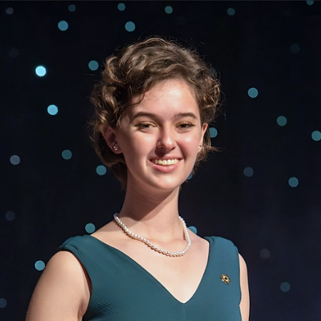

**test readme**
striders team / acad 275 / content build
# project name: striders team

welcome to the striders team project! our mission is to revolutionize the way you interact with your footwear through innovative customization. dive into a world where your shoes are not just an accessory, but a canvas for your personal expression.

this site was made by the striders team for the acad-275 course at usc's iovine and young academy. through the course, we learned to use html, css, javascript, and jquery to create a website.

## skills learned and used

- [introduction](#introduction)
- [features](#features)
- [getting started](#getting-started)
  - [prerequisites](#prerequisites)
  - [installation](#installation)
- [usage](#usage)
- [contributing](#contributing)
- [credits](#credits)
- [license](#license)
- [contact](#contact)

## introduction

the striders team project is part of the acad 275 course, focusing on building content that stands out. our project allows users to customize their shoes with a wide range of charms and accessories, making each pair unique and personal.

## features

- **customization galore**: choose from hundreds of charms to add a personal touch to your footwear.
- **interactive design tool**: use our web-based tool to visualize your customizations in real-time.
- **community designs**: get inspired by designs created by the community and vote for your favorites.

## getting started

### prerequisites

- a modern web browser.
- internet connection.
- an excitement to decorate your shoes!

## meet the team

our project is powered by a dedicated team of innovators and creators. get to know us a bit better!

### :smiley: name 1

**short bio**: a brief description of name 1. this could include interests, what they bring to the project, or fun facts.
**role**: what name 1 does on the team.

### :sunglasses: name 2

- **short bio**: a brief description of name 2. this could include their background, what drives them, or hobbies they enjoy.
- **role**: what name 2 does on the team.

### :nerd_face: name 3

- **short bio**: a brief description of name 3. highlight their expertise, passions, or contributions to the project.
- **role**: what name 3 does on the team.

### :star_struck: name 4

- **short bio**: a brief description of name 4. this might focus on their creative process, what inspires them, or achievements.
- **role**: what name 4 does on the team.

### :partying_face: name 5

- **short bio**: a brief description of name 5. include information such as their vision for the project, leadership style, or personal motto.
- **role**: what name 5 does on the team.

### :muscle: name 6

- **short bio**: a brief description of name 6. you could mention their technical skills, what they love about the project, or future goals.
- **role**: what name 6 does on the team.

## credits

this project is made possible thanks to the hard work of our team members and the support from acad 275, including professor patrick dent, and our lovely tas dhruvam zaveri and neeraj salunke.
